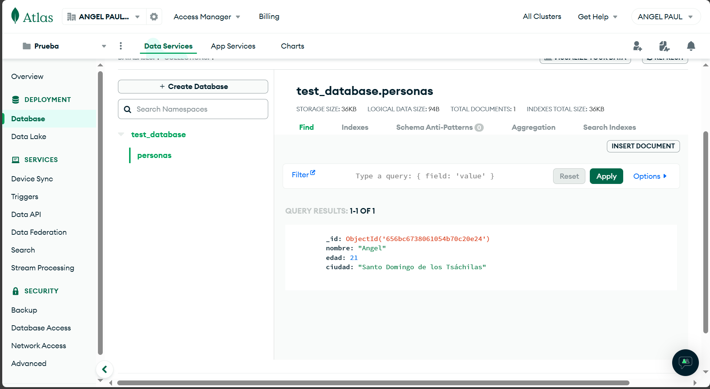
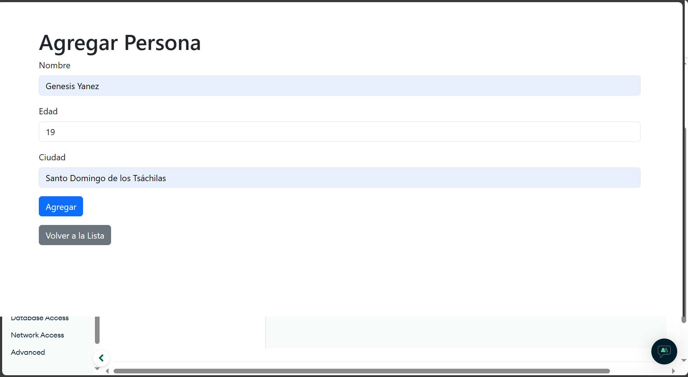
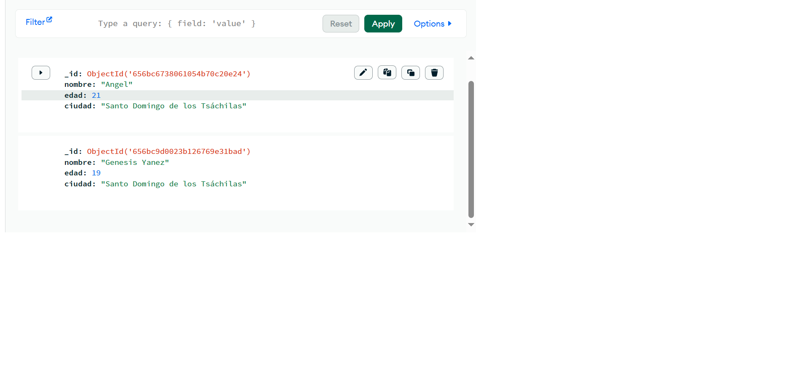
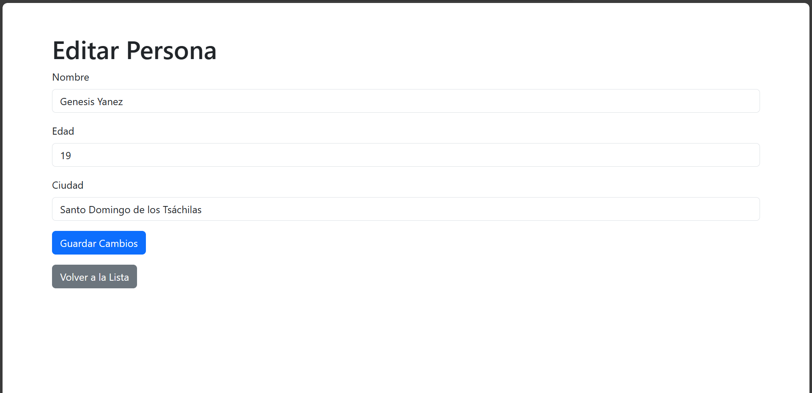
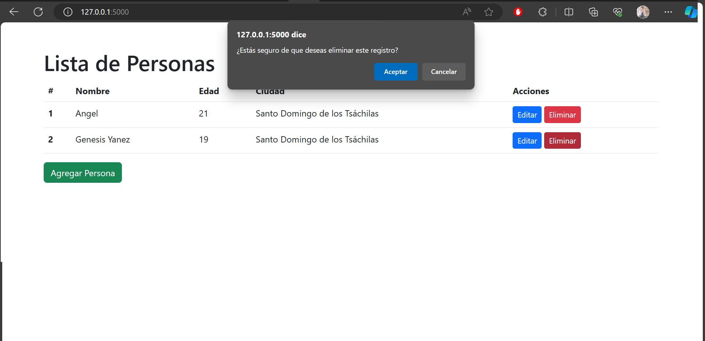

# CRUD Project with Flask and MongoDB Atlas

This project is a simple CRUD application developed with Flask and uses MongoDB Atlas as the database.

## Screenshots
### MongoDB Atlas
<!-- agregar imagenes al readme.md -->

### Add people

### View data

### Update people

### Delete people



## Environment Setup

1. **MongoDB Atlas Configuration:**
   - Create an account on [MongoDB Atlas](https://www.mongodb.com/cloud/atlas).
   - Create a cluster and obtain the connection string.

2. **Environment Variables Configuration:**
   - Create a `.env` file in the project's root directory.
   - Add the MongoDB Atlas connection string to the `.env` file as `MONGO_URI="your_connection_string"`.

## Installation

1. Clone the repository:

    ```bash
    git clone https://github.com/Anyel-ec/MongoDBAtlas-CRUD-Flask
    ```

2. Install dependencies:

    ```bash
    pip install -r requirements.txt
    ```

## Execution

Run the application with the following command:

```bash
python app.py
```

The application will be available at [http://localhost:5000](http://localhost:5000).

## Project Structure

Brief explanation of the project's directory and file structure.

```
your-project/
|-- app.py
|-- templates/
|   |-- index.html
|   |-- add.html
|   |-- edit.html
|-- requirements.txt
|-- app.py
|-- .env
|-- other files and folders...
```

## Contributions

Feel free to contribute to this project. Create a fork, make your changes, and submit a pull request.

## Support

For any questions or concerns, you can reach us on WhatsApp at [+593 99 167 5490](https://wa.me/593991675490).


## License

This project is under the MIT License. See the [LICENSE](LICENSE) file for more details.
